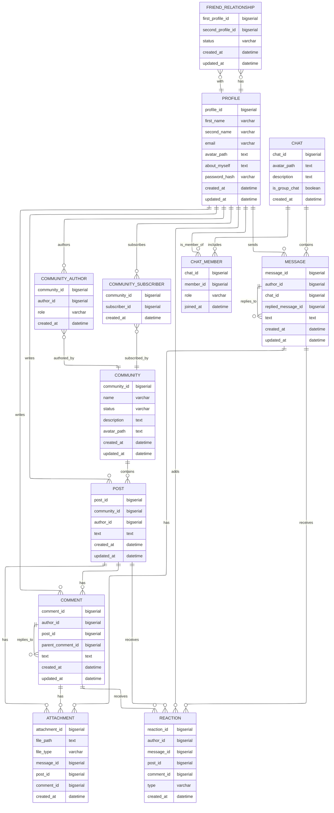

```mermaid
%%{init: {'layout': 'elk', 'theme':'', 'flowchart': {'curve':'monotonex'}}}%%

erDiagram
    PROFILE {
        profile_id bigserial
        first_name varchar
        second_name varchar
        email varchar
        avatar_path text
        about_myself text
        password_hash varchar
        created_at datetime
        updated_at datetime
    }

    FRIEND_RELATIONSHIP {
        first_profile_id bigserial
        second_profile_id bigserial
        status varchar
        created_at datetime
        updated_at datetime
    }

    COMMUNITY {
        community_id bigserial
        name varchar
        status varchar
        description text
        avatar_path text
        created_at datetime
        updated_at datetime
    }

    COMMUNITY_AUTHOR {
        community_id bigserial
        author_id bigserial
        role varchar
        created_at datetime
    }

    COMMUNITY_SUBSCRIBER {
        community_id bigserial
        subscriber_id bigserial
        created_at datetime
    }

    POST {
        post_id bigserial
        community_id bigserial
        author_id bigserial
        text text
        created_at datetime
        updated_at datetime
    }

    COMMENT {
        comment_id bigserial
        author_id bigserial
        post_id bigserial
        parent_comment_id bigserial
        text text
        created_at datetime
        updated_at datetime
    }

    CHAT {
        chat_id bigserial
        avatar_path text
        description text
        is_group_chat boolean
        created_at datetime
    }

    CHAT_MEMBER {
        chat_id bigserial
        member_id bigserial
        role varchar
        joined_at datetime
    }

    MESSAGE {
        message_id bigserial
        author_id bigserial
        chat_id bigserial
        replied_message_id bigserial
        text text
        created_at datetime
        updated_at datetime
    }

    ATTACHMENT {
        attachment_id bigserial
        file_path text
        file_type varchar
        message_id bigserial
        post_id bigserial
        comment_id bigserial
        created_at datetime
    }

    REACTION {
        reaction_id bigserial
        author_id bigserial
        message_id bigserial
        post_id bigserial
        comment_id bigserial
        type varchar
        created_at datetime
    }

    PROFILE ||--o{ FRIEND_RELATIONSHIP : "has"
    FRIEND_RELATIONSHIP }o--|| PROFILE : "with"
    
    PROFILE ||--o{ COMMUNITY_AUTHOR : "authors"
    COMMUNITY_AUTHOR }o--|| COMMUNITY : "authored_by"
    
    PROFILE ||--o{ COMMUNITY_SUBSCRIBER : "subscribes"
    COMMUNITY_SUBSCRIBER }o--|| COMMUNITY : "subscribed_by"
    
    COMMUNITY ||--o{ POST : "contains"
    PROFILE ||--o{ POST : "writes"
    
    POST ||--o{ COMMENT : "has"
    PROFILE ||--o{ COMMENT : "writes"
    COMMENT ||--o{ COMMENT : "replies_to"
    
    CHAT ||--o{ CHAT_MEMBER : "includes"
    PROFILE ||--o{ CHAT_MEMBER : "is_member_of"
    
    CHAT ||--o{ MESSAGE : "contains"
    PROFILE ||--o{ MESSAGE : "sends"
    MESSAGE ||--o{ MESSAGE : "replies_to"
    
    MESSAGE ||--o{ ATTACHMENT : "has"
    POST ||--o{ ATTACHMENT : "has"
    COMMENT ||--o{ ATTACHMENT : "has"
    
    MESSAGE ||--o{ REACTION : "receives"
    POST ||--o{ REACTION : "receives"
    COMMENT ||--o{ REACTION : "receives"
    PROFILE ||--o{ REACTION : "adds"
```
