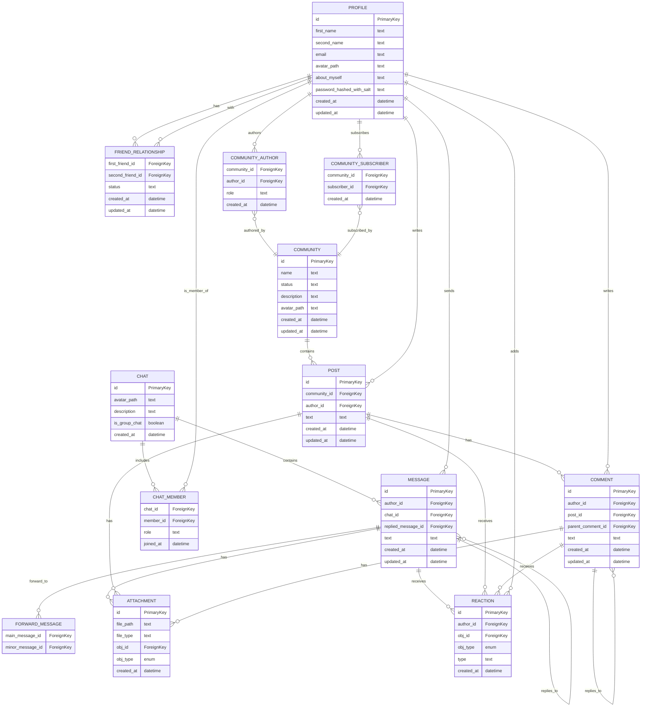

```mermaid

%%{ init: { "flowchart": { "defaultRenderer": "elk" } } }%%

erDiagram
    PROFILE {
        id PrimaryKey
        first_name text
        second_name text
        email text
        avatar_path text
        about_myself text
        password_hashed_with_salt text
        created_at datetime
        updated_at datetime
    }

    FRIEND_RELATIONSHIP {
        first_friend_id ForeignKey
        second_friend_id ForeignKey
        status text
        created_at datetime
        updated_at datetime
    }

    COMMUNITY {
        id PrimaryKey
        name text
        status text
        description text
        avatar_path text
        created_at datetime
        updated_at datetime
    }

    COMMUNITY_AUTHOR {
        community_id ForeignKey
        author_id ForeignKey
        role text
        created_at datetime
    }

    COMMUNITY_SUBSCRIBER {
        community_id ForeignKey
        subscriber_id ForeignKey
        created_at datetime
    }

    POST { 
        id PrimaryKey
        community_id ForeignKey
        author_id ForeignKey
        text text
        created_at datetime
        updated_at datetime
    }

    COMMENT {
        id PrimaryKey
        author_id ForeignKey
        post_id ForeignKey
        parent_comment_id ForeignKey
        text text
        created_at datetime
        updated_at datetime
    }

    CHAT {
        id PrimaryKey
        avatar_path text
        description text
        is_group_chat boolean
        created_at datetime
    }

    CHAT_MEMBER {
        chat_id ForeignKey
        member_id ForeignKey
        role text
        joined_at datetime
    }

    MESSAGE {
        id PrimaryKey
        author_id ForeignKey
        chat_id ForeignKey
        replied_message_id ForeignKey
        text text
        created_at datetime
        updated_at datetime
    }
        
    FORWARD_MESSAGE {
        main_message_id ForeignKey
        minor_message_id ForeignKey
    }
        
    ATTACHMENT {
        id PrimaryKey
        file_path text
        file_type text
        obj_id ForeignKey
        obj_type enum
        created_at datetime
    }

    REACTION {
        id PrimaryKey
        author_id ForeignKey
        obj_id ForeignKey
        obj_type enum
        type text
        created_at datetime
    }

    PROFILE ||--o{ FRIEND_RELATIONSHIP : "has"
    FRIEND_RELATIONSHIP }o--|| PROFILE : "with"

    PROFILE ||--o{ COMMUNITY_AUTHOR : "authors"
    COMMUNITY_AUTHOR }o--|| COMMUNITY : "authored_by"

    PROFILE ||--o{ COMMUNITY_SUBSCRIBER : "subscribes"
    COMMUNITY_SUBSCRIBER }o--|| COMMUNITY : "subscribed_by"

    COMMUNITY ||--o{ POST : "contains"
    PROFILE ||--o{ POST : "writes"

    POST ||--o{ COMMENT : "has"
    PROFILE ||--o{ COMMENT : "writes"
    COMMENT ||--o{ COMMENT : "replies_to"

    CHAT ||--o{ CHAT_MEMBER : "includes"
    PROFILE ||--o{ CHAT_MEMBER : "is_member_of"

    CHAT ||--o{ MESSAGE : "contains"
    PROFILE ||--o{ MESSAGE : "sends"
    MESSAGE ||--o{ MESSAGE : "replies_to"
    
    MESSAGE ||--o{ FORWARD_MESSAGE: "forward_to"

    MESSAGE ||--o{ ATTACHMENT : "has"
    POST ||--o{ ATTACHMENT : "has"
    COMMENT ||--o{ ATTACHMENT : "has"

    MESSAGE ||--o{ REACTION : "receives"
    POST ||--o{ REACTION : "receives"
    COMMENT ||--o{ REACTION : "receives"
    PROFILE ||--o{ REACTION : "adds"
```
https://dbdocs.io/mr.loshkariov/db_dz1?view=relationships
